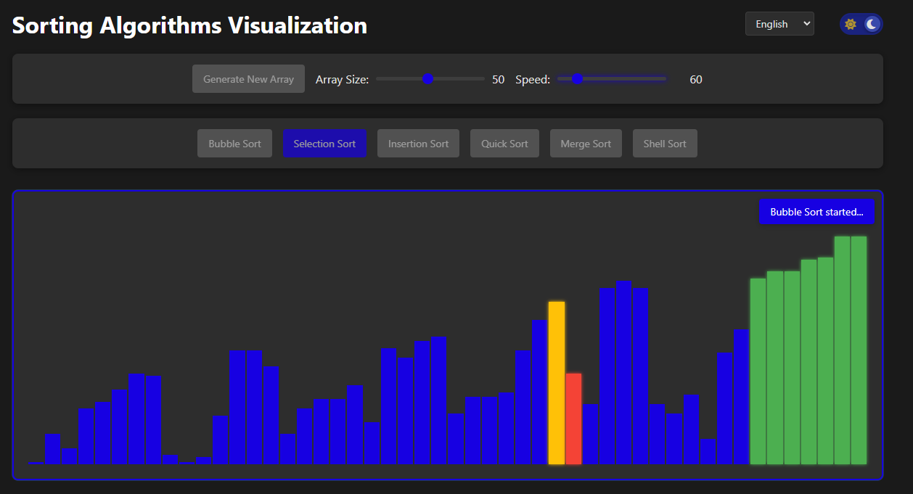

# Визуализация алгоритмов сортировки

Интерактивное веб-приложение для визуализации процесса работы различных алгоритмов сортировки. Проект помогает понять, как работают алгоритмы сортировки на практике, наглядно демонстрируя каждый шаг сортировки.



## Содержание
- [Реализованные алгоритмы](#реализованные-алгоритмы-сортировки)
- [Функциональность](#функциональность)
- [Установка и запуск](#установка-и-запуск)
- [Как использовать](#как-использовать)
- [Технологии](#технологии)
- [Преимущества проекта](#преимущества-проекта)
- [Автор](#автор)

## Реализованные алгоритмы сортировки

1. **Сортировка пузырьком (Bubble Sort)** - простой алгоритм сортировки, который многократно проходит по массиву, сравнивая соседние элементы и меняя их местами, если они расположены в неправильном порядке.

2. **Сортировка выбором (Selection Sort)** - алгоритм сортировки, который выбирает наименьший элемент из несортированной части и помещает его в конец отсортированной части.

3. **Сортировка вставками (Insertion Sort)** - алгоритм сортировки, который строит отсортированный массив по одному элементу за раз, вставляя каждый новый элемент в правильное место.

4. **Быстрая сортировка (Quick Sort)** - эффективный алгоритм сортировки, основанный на стратегии "разделяй и властвуй", который выбирает опорный элемент и разделяет массив на подмассивы элементов меньше и больше опорного.

5. **Сортировка слиянием (Merge Sort)** - эффективный, стабильный алгоритм сортировки, основанный на стратегии "разделяй и властвуй", который делит массив пополам, сортирует обе половины и затем объединяет их.

## Функциональность

- Генерация случайных массивов для сортировки
- Настройка размера массива (количества элементов)
- Регулировка скорости визуализации (от очень медленной до быстрой)
- Защита от некорректного поведения (невозможно запустить сортировку на уже отсортированном массиве)
- Переключение между светлой и темной темой
- Примеры реализации алгоритмов на нескольких языках программирования (C++, C, Python, JavaScript)
- Возможность копирования примеров кода
- Цветовая индикация текущего состояния элементов:
  - Синий - обычный элемент
  - Красный - текущий обрабатываемый элемент
  - Желтый - элемент, с которым сравнивается текущий
  - Зеленый - элемент, который находится на своей конечной позиции

## Установка и запуск

1. Клонируйте репозиторий:
   ```
   git clone https://github.com/username/sorting-visualizer.git
   ```
2. Перейдите в папку проекта:
   ```
   cd sorting-visualizer
   ```
3. Откройте файл `index.html` в вашем браузере

Приложение не требует установки дополнительных библиотек или сборки.

## Как использовать

1. Откройте файл `index.html` в вашем браузере
2. Используйте ползунок "Размер массива" для настройки количества элементов
3. Отрегулируйте скорость анимации с помощью ползунка "Скорость"
4. Нажмите кнопку "Создать новый массив" для генерации нового набора данных
5. Выберите один из алгоритмов сортировки, нажав на соответствующую кнопку
6. Наблюдайте за процессом сортировки в реальном времени
7. Изучайте примеры кода для разных языков программирования в нижней части страницы

## Технологии

- HTML5
- CSS3
- JavaScript (ES6+)
- Использование асинхронных функций (async/await) для управления анимацией
- Highlight.js для подсветки синтаксиса кода
- Font Awesome для иконок

## Преимущества проекта

- Наглядная демонстрация работы алгоритмов сортировки
- Интерактивный интерфейс для экспериментов с различными параметрами
- Простой и понятный код, который можно использовать в образовательных целях
- Адаптивный дизайн для работы на различных устройствах
- Поддержка темной и светлой темы

## Автор

[Ваше имя] - [ваш email или другая контактная информация]

## Лицензия

Этот проект распространяется под лицензией MIT. Подробности смотрите в файле [LICENSE](LICENSE). 